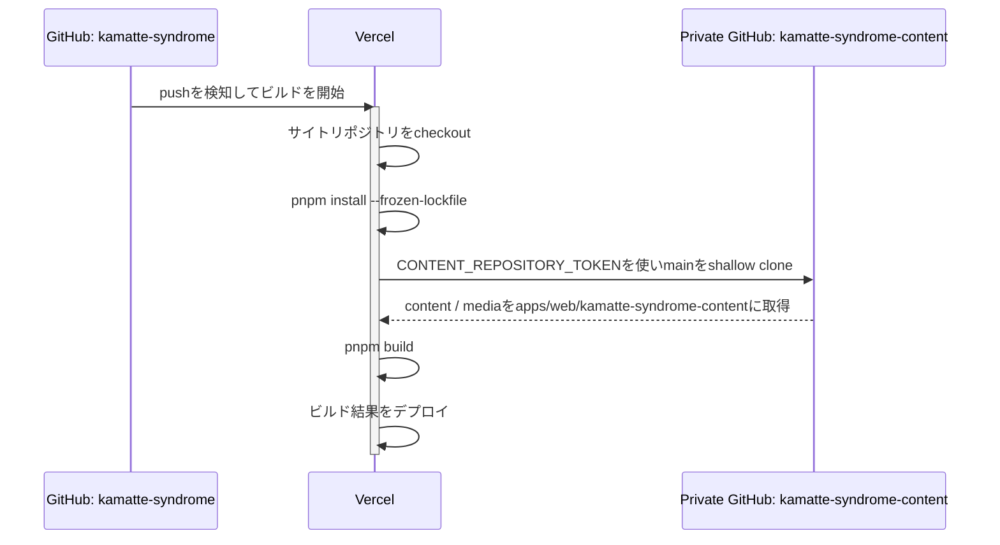

# かまって☆しんどろ〜む

https://kamatte.me/

> plz kamatte me!!!

[かまって☆しんどろ〜む](https://kamatte.me/)のソースコードです。サイトコンテンツとメディアはPrivateリポジトリ`kamatte-syndrome-content`で管理しています。

## リポジトリ構成

```text
.
├── apps/
│   └── web/                         # サイト本体
├── packages/                        # アプリ内で使う共有パッケージ
│   ├── image-optimization-core/
│   ├── oembed-endpoint-resolver/
│   ├── remark-gfm-subset/
│   ├── remark-mdx-url-embed/
│   ├── sitemap-generator/
│   ├── tsconfig/
│   ├── vite-plugin-optimized-social-image/
│   └── vite-plugin-react-optimized-responsive-image/
├── pnpm-workspace.yaml
└── package.json
```

アプリ固有の構成、環境変数、デプロイ方法は [apps/web/README.md](apps/web/README.md) を参照してください。

## 必要な環境

- Node.js: [`.node-version`](.node-version)
- pnpm: [`package.json`](package.json) の `packageManager`
- [`apps/web/content-collections.ts`](apps/web/content-collections.ts)のFrontmatter・JSONのスキーマとファイル構成を読み、サイトコンテンツを再現するガッツ（サイトを完全にローカルで動かしたい場合）

## セットアップ

公開リポジトリをcloneして、依存関係をインストールします。

```sh
git clone https://github.com/kamatte-me/kamatte-syndrome.git
cd kamatte-syndrome
pnpm install
```

## ローカル用コンテンツ

サイトコンテンツはすべてPrivateリポジトリ`kamatte-syndrome-content`で管理しており、読み取りアクセスやclone手順は提供していません。サイト全体をローカルで動かすには、[apps/web/content-collections.ts](apps/web/content-collections.ts)のFrontmatter・JSONのスキーマとパス定義を読み、`apps/web/kamatte-syndrome-content/`以下のファイルとメディア構成を自力で完全再現してください。

`apps/web/kamatte-syndrome-content`はGit管理対象外です。実コンテンツを取得する`pnpm --filter web sync:content`は、Vercelのビルド環境専用です。

## 開発コマンド

すべてリポジトリルートで実行します。

| コマンド | 内容 |
| --- | --- |
| `pnpm dev` | Webアプリの開発サーバーを起動 |
| `pnpm build` | すべてのworkspaceパッケージとアプリをビルド |
| `pnpm start` | ビルド済みアプリを起動 |
| `pnpm lint` | Biomeによるフォーマット・lintチェック |
| `pnpm lint:fix` | Biomeによる安全な自動修正 |
| `pnpm typecheck` | workspace全体のTypeScript型チェック |
| `pnpm test` | workspace全体のVitestテスト |
| `pnpm vercel:env:pull` | Vercelの環境変数を各workspaceに取得 |

Webアプリだけを対象にする場合は、たとえば`pnpm --filter web test`のように`--filter web`を付けます。

## コンテンツとメディア

記事、プロフィール、ポートフォリオ、Cultureページのデータとメディアは、Privateリポジトリ`kamatte-syndrome-content`にあります。アプリはContent CollectionsでMarkdown / MDX / JSONを読み込み、画像はビルド時に最適化します。

なお、`kamatte-syndrome-content`のコンテンツ管理には、GitベースのヘッドレスCMSである[Sveltia CMS](https://sveltiacms.app/en/)を使用しています。

### 非公開コンテンツの保護

公開済み・公開前を問わず、記事本文とメディアはすべてPrivateリポジトリ`kamatte-syndrome-content`で管理します。公開リポジトリ`kamatte-syndrome`にはサイトアプリケーションのソースコードのみを置き、コンテンツそのものは含めません。

この分離により、サイトリポジトリを閲覧できるだけでは、公開前や下書き中の記事本文・メディアにアクセスできず、開発中のコンテンツが意図せず公開ソースに含まれることを防げます。

リポジトリの公開範囲とサイトでの公開制御は別です。未来の `publishedAt` を持つブログ記事は、`VITE_SHOW_UNPUBLISHED_CONTENT=1` を明示的に設定しない限りサイトに表示されません。公開環境でこの値を設定する場合は、意図して公開前記事を表示するケースに限定してください。

Vercelでは、公開されない`CONTENT_REPOSITORY_TOKEN`を用いて`pnpm sync:content`を実行し、コンテンツリポジトリを取得します。このトークンは外部には配布しません。CIではGitHub Appの短期トークンを発行し、`actions/checkout`でコンテンツリポジトリを配置します。`pnpm --filter web sync:content`は既存のコンテンツディレクトリを置き換えないよう、存在時に停止します。

## 品質チェック

変更内容に応じて、少なくとも次を実行します。

```sh
pnpm lint
pnpm typecheck
pnpm test
pnpm build
```

## デプロイ

Vercelで`apps/web`をRoot Directoryとしてデプロイします。インストールには`pnpm install --frozen-lockfile`、ビルドには`pnpm sync:content && pnpm build`を使用します。詳しい設定は[apps/web/vercel.json](apps/web/vercel.json)を参照してください。



`CONTENT_REPOSITORY_TOKEN`はVercelの環境変数として設定し、`pnpm sync:content`がPrivateリポジトリを読むためだけに使用します。クライアントに公開される`VITE_`接頭辞の環境変数には設定しないでください。

## ライセンス

このリポジトリのソースコードは[MIT License](LICENSE)の下で提供しています。サイトコンテンツとメディアはPrivateリポジトリで別管理しており、このリポジトリには含まれません。
