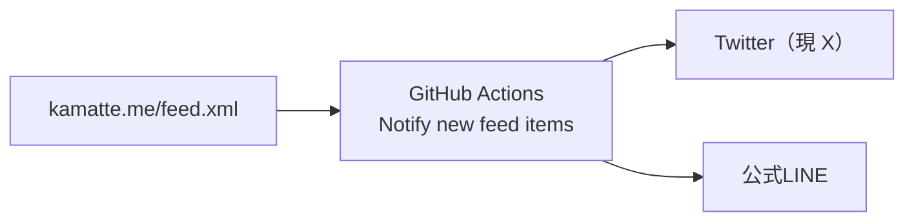
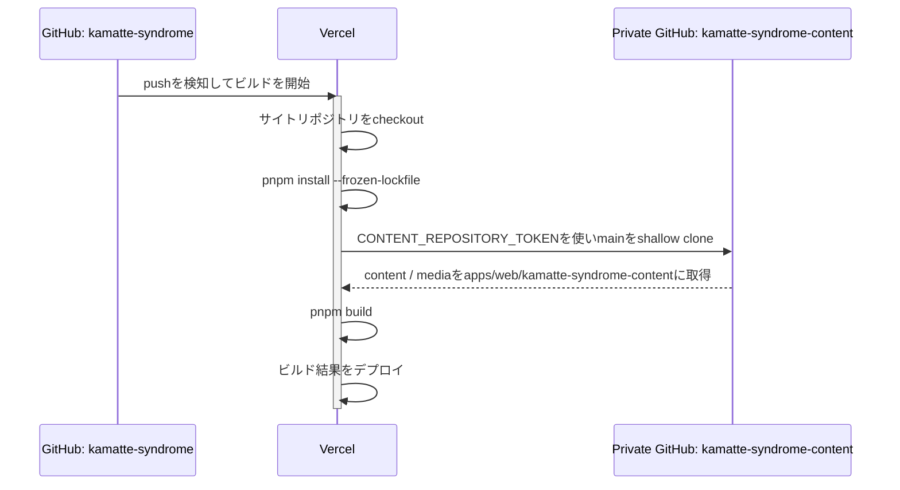

# かまって☆しんどろ〜む

https://kamatte.me/

> plz kamatte me!!!

kamatteの公式サイト「[かまって☆しんどろ〜む](https://kamatte.me/)」のソースコードです。

## 特徴

### コンテンツとメディア

サイトコンテンツとメディアはPrivateリポジトリ`kamatte-syndrome-content`で管理しています。コンテンツ管理にはGitベースのヘッドレスCMSである[Sveltia CMS](https://sveltiacms.app/en/)を使用しています。

ブログ記事、プロフィール、ポートフォリオ、CultureページのデータはContent CollectionsでMarkdown / MDX / JSONとして読み込み、画像はビルド時に最適化します。

#### 非公開コンテンツの保護

TanStack StartのSSRで、公開日が未来または未設定の記事をサーバー側で除外します。公開前記事はHTML、RSS、sitemap、クライアントへ渡すデータに含まれません。`VITE_SHOW_UNPUBLISHED_CONTENT=1`を明示的に設定した場合だけ、開発用に表示できます。

### Vercelでホスティング

Webサイトは[Vercel](https://vercel.com/)でホスティングしています。本当はCloudflare Workersを使いたかったけど、無料枠の制限が厳山厳男だったため、やむなくVercelを利用しています。

余談ですが、`kamatte-syndrome-content`のSveltia CMSはCloudflare Workersでホスティングしています。

### Twitter（現 X） / 公式LINE への新着ブログ記事通知

GitHub Actionsの[`Notify new feed items`](.github/workflows/notify-new-feed-items.yml)でAtomフィードを監視し、新着ブログ記事をXと公式LINEへ通知します。



## リポジトリ構成

```text
.
├── .github/
│   ├── actions/                     # リポジトリ内で使うGitHub Actions
│   │   ├── broadcast-to-line/
│   │   ├── cleanup-artifacts/
│   │   ├── feed-watcher/
│   │   ├── find-latest-artifact/
│   │   └── post-to-x/
│   └── workflows/                   # CI・新着記事通知などのWorkflow
├── apps/
│   └── web/                         # サイト本体
├── packages/                        # アプリ内で使う共有パッケージ
│   ├── github-actions-artifacts/     # GitHub Actions Artifact操作の共通処理
│   ├── image-optimization-core/
│   ├── oembed-endpoint-resolver/
│   ├── remark-gfm-subset/
│   ├── remark-mdx-url-embed/
│   ├── sitemap-generator/
│   ├── tsconfig/
│   ├── vite-plugin-optimized-social-image/
│   └── vite-plugin-react-optimized-responsive-image/
├── pnpm-workspace.yaml
└── package.json
```

アプリ固有の構成、環境変数、デプロイ方法は [apps/web/README.md](apps/web/README.md) を参照してください。

## 必要な環境

- Node.js: [`.node-version`](.node-version)
- pnpm: [`package.json`](package.json) の `packageManager`
- [`apps/web/content-collections.ts`](apps/web/content-collections.ts)のFrontmatter・JSONのスキーマとファイル構成を読み、サイトコンテンツを再現するガッツ（サイトを完全にローカルで動かしたい場合）

## セットアップ

公開リポジトリをcloneして、依存関係をインストールします。

```sh
git clone https://github.com/kamatte-me/kamatte-syndrome.git
cd kamatte-syndrome
pnpm install
```

## ローカル用コンテンツ

サイトコンテンツはすべてPrivateリポジトリ`kamatte-syndrome-content`で管理しており、読み取りアクセスやclone手順は提供していません。サイト全体をローカルで動かすには、[apps/web/content-collections.ts](apps/web/content-collections.ts)のFrontmatter・JSONのスキーマとパス定義を読み、`apps/web/kamatte-syndrome-content/`以下のファイルとメディア構成を自力で完全再現してください。

`apps/web/kamatte-syndrome-content`はGit管理対象外です。実コンテンツを取得する`pnpm --filter web sync:content`は、Vercelのビルド環境専用です。

## 開発コマンド

すべてリポジトリルートで実行します。

| コマンド | 内容 |
| --- | --- |
| `pnpm dev` | Webアプリの開発サーバーを起動 |
| `pnpm build` | すべてのworkspaceパッケージとアプリをビルド |
| `pnpm start` | ビルド済みアプリを起動 |
| `pnpm lint` | Biomeによるフォーマット・lintチェック |
| `pnpm lint:fix` | Biomeによる安全な自動修正 |
| `pnpm typecheck` | workspace全体のTypeScript型チェック |
| `pnpm test` | workspace全体のVitestテスト |
| `pnpm vercel:env:pull` | Vercelの環境変数を各workspaceに取得 |

Webアプリだけを対象にする場合は、たとえば`pnpm --filter web test`のように`--filter web`を付けます。

## 品質チェック

変更内容に応じて、少なくとも次を実行します。

```sh
pnpm lint
pnpm typecheck
pnpm test
pnpm build
```

## デプロイ

Vercelで`apps/web`をRoot Directoryとしてデプロイします。インストールには`pnpm install --frozen-lockfile`、ビルドには`pnpm sync:content && pnpm build`を使用します。詳しい設定は[apps/web/vercel.json](apps/web/vercel.json)を参照してください。



`CONTENT_REPOSITORY_TOKEN`はVercelの環境変数として設定し、`pnpm sync:content`がPrivateリポジトリを読むためだけに使用します。クライアントに公開される`VITE_`接頭辞の環境変数には設定しないでください。

## ライセンス

このリポジトリのソースコードは[MIT License](LICENSE)の下で提供しています。サイトコンテンツとメディアはPrivateリポジトリで別管理しており、このリポジトリには含まれません。
